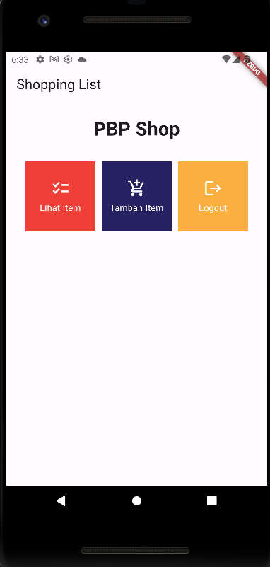

# ACI REZEKI SHOP MOBILE

Nama : Ilham Abdillah Alhamdi

Kelas : PBP-B

NPM : 2206081194

## Daftar Isi
- [Tugas 8](#tugas-8)
  - [Perbedaan `Navigator.push()` dan `Navigator.pushReplacement()` pada Flutter](#perbedaan-navigatorpush-dan-navigatorpushreplacement-pada-flutter)
  - [_Layout Widget_ pada Flutter](#layout-widget-pada-flutter)
  - [Elemen Input pada Form yang Digunakan](#elemen-input-pada-form-yang-digunakan)
  - [Penerapan _Clean Architecture_](#penerapan-clean-architecture)
  - [Implementasi Step by Step (Tugas 8)](#implementasi-step-by-step-tugas-8)
- [Tugas 7](#tugas-7)
  - [Perbedaan _Stateless_ dan _Stateful Widget_ pada Flutter](#perbedaan-stateless-dan-stateful-widget-pada-flutter)
  - [Penjelasan Widget yang Digunakan](#penjelasan-widget-yang-digunakan)
  - [Implementasi Step by Step (Tugas 6)](#implementasi-step-by-step-tugas-6)
  - [Bonus (Tugas 6)](#bonus-tugas-6)

<details open>
<summary><h2 id="tugas-9">Tugas 9</h2></summary>

### Data JSON dan Model

**Apakah bisa kita melakukan pengambilan data JSON tanpa membuat model terlebih dahulu? Jika iya, apakah hal tersebut lebih baik daripada membuat model sebelum melakukan pengambilan data JSON?**

Ya, memungkinkan untuk mengambil data JSON tanpa membuat model terlebih dahulu. Ini dapat dilakukan, misalnya, dengan menggunakan HTTP request seperti http.get di Flutter untuk mendapatkan data dari API.

Tapi, lebih disarankan untuk membuat model dahulu, karena hal ini dapat memberikan beberapa keuntungan. Dengan membuat model, kita dapat lebih terstruktur dalam mengelola dan mem-parsing data. Model dapat membantu dalam memahami format data yang diharapkan dan memberikan jenis data yang lebih jelas. 

Jadi, meskipun mungkin memungkinkan untuk mengambil data JSON tanpa membuat model, membuat model seringkali dianggap lebih baik untuk memperoleh manfaat tambahan dalam pengelolaan dan pemrosesan data.


### _CookieRequest_

**Jelaskan fungsi dari CookieRequest dan jelaskan mengapa instance CookieRequest perlu untuk dibagikan ke semua komponen di aplikasi Flutter!**

CookieRequest dari package yang telah disediakan merupakan objek atau kelas yang berfungsi untuk menangani permintaan HTTP yang melibatkan pengelolaan cookie. Fungsinya utama adalah untuk mengelola informasi sesi atau preferensi pengguna yang disimpan dalam bentuk cookie.

Mengapa perlu membagikan instance CookieRequest ke semua komponen di aplikasi Flutter? Dalam pengembangan website, biasanya cookie digunakan untuk menyimpan informasi tentang sesi atau preferensi pengguna. Saat ada permintaan HTTP, cookie ini bisa dikirim dari klien ke server lewat header permintaan, sehingga server mengetahui status atau konteks khusus dari klien.

Di sini, Provider dalam Flutter digunakan buat mengatur state dan menyediakan instance CookieRequest ke seluruh aplikasi. Ini membuat semua bagian aplikasi dapat mengakses dan memanfaatkan instance CookieRequest tanpa harus membuat instance yang baru. Ini sesuai dengan prinsip _singleton_ yang menyatakan bahwa sebuah kelas hanya boleh memiliki satu instance saja dan menyediakan akses global ke instance tersebut.

Karena CookieRequest itu menyimpan informasi yang diperlukan untu berinteraksi dengan server Django, misalnya token atau info otentikasi lainnya, dengan memakai instance yang sama, kita dapat memastikan bahwa semua bagian aplikasi yang membutuhkan info otentikasi bisa menggunakannya dengan mudah.

### Mekanisme Pengambilan Data JSON

Mekanisme pengambilan data dari JSON hingga dapat ditampilkan pada Flutter melibatkan beberapa langkah:

1. Membuat Request HTTP: 
   Pertama, kita perlu membuat request HTTP ke endpoint yang menyediakan data dalam format JSON³. Ini biasanya dilakukan menggunakan package http.
   
  ``` final response = await Uri.parse('https://www.example.com');```

2. Decoding Data JSON: 
   Setelah mendapatkan response, kita perlu mendecode data JSON menjadi format yang dapat dipahami oleh Dart. Ini dapat dilakukan dengan menggunakan fungsi jsonDecode².

  ```var data = jsonDecode(response.body);```

3. Menampilkan Data pada Widget: Setelah data berhasil diubah menjadi model, data tersebut dapat ditampilkan pada widget Flutter. Misalnya, kita dapat menampilkan nama dan umur dari contoh di atas pada widget Text.
   
  ```Text('Name: ${sample.name}, Age: ${sample.age}');```

Dengan demikian, data dari JSON dapat diambil dan ditampilkan pada Flutter.

### Mekanisme Autentikasi Django-Flutter

Untuk menjelaskan mekanisme autentikasi dari input data akun pada Flutter ke Django hingga tampilnya menu pada Flutter, kita bisa mengikuti langkah-langkah berikut:

1. Input Data Akun pada Flutter:
    Pengguna memasukkan informasi akun melalui formulir atau metode input lainnya di UI Flutter.
    Informasi ini mungkin melibatkan data seperti username dan password.

2. Permintaan Ke Backend Django:
    Flutter mengirimkan data akun ke backend Django melalui permintaan HTTP, misalnya dengan menggunakan metode  `http.post`.
    Permintaan ini berisi data yang diperlukan untuk proses otentikasi, seperti nama pengguna dan kata sandi.

3. Otentikasi di Backend Django:
    Django menerima permintaan dan melakukan proses otentikasi menggunakan data yang diberikan.
    Jika proses otentikasi berhasil, Django menghasilkan session atau informasi otentikasi lainnya yang perlu dikirim kembali ke Flutter.
    Jika proses otentikasi gagal, Django memberikan respon yang sesuai dengan kesalahan.

4. Respon dari Django ke Flutter:
    Django mengirimkan respon berupa data JSON yang berisi informasi yang dibutuhkan untuk validasi dan pesan yang menunjukkan apakah proses masuk berhasil atau tidak.
    Flutter menerima respon dan mengolahnya.

5. Tampilan Menu pada Flutter:
    Jika proses masuk berhasil, Flutter menavigasi pengguna ke tampilan menu atau halaman lain yang sesuai dengan autentikasi yang berhasil.
    Jika proses masuk gagal, Flutter menampilkan pesan kesalahan yang diterima dari Django.

Untuk membuat fungsi login, register, dan login dalam aplikasi Flutter, kita dapat membuat fungsi atau metode yang melakukan tugas berikut:

1. Fungsi Login:
    Mengirimkan data akun ke backend Django.
    Mengelola respon dari Django, termasuk menyimpan informasi otentikasi dan menavigasi pengguna ke halaman yang sesuai.

2. Fungsi Registrasi (Bonus):
    Mirip dengan fungsi login, tetapi dengan langkah-langkah tambahan untuk membuat akun baru.

3. Fungsi Logout:
    Mengirim permintaan keluar ke backend Django untuk mengakhiri sesi pengguna.
    Membersihkan atau menghapus informasi otentikasi lokal di Flutter.

### Widget yang Digunakan

Berikut adalah daftar widget yang dipergunakan dalam tugas:

- MaterialApp: Widget utama yang digunakan untuk mengatur konfigurasi aplikasi Flutter.
- Scaffold: Widget yang memberikan kerangka dasar untuk tampilan visual aplikasi, termasuk AppBar dan body.
- AppBar: Menampilkan bilah aplikasi di bagian atas layar.
- Container: Digunakan untuk memberikan gaya dengan latar belakang gradient.
- Column: Mengatur widget anak secara vertikal.
- Stack: Menempatkan widget anak di atas satu sama lain.
- Text: Menampilkan teks dengan gaya tertentu.
- TextField: Input teks untuk memasukkan username dan password.
- ElevatedButton: Tombol dengan latar belakang terisi. Digunakan untuk tombol masuk.
- Navigator: Digunakan untuk navigasi antar halaman.
- Form: Kontainer untuk elemen formulir. Memungkinkan validasi dan pengiriman formulir.
- GlobalKey: Kunci global untuk mengakses state Form.
- TextFormField: Elemen formulir khusus untuk menangani input teks.
- Icon: Ikon grafis.
- Drawer: Menu sisi kiri yang dapat diakses dengan menggeser dari kiri.
- FutureBuilder: Widget untuk membangun antarmuka berdasarkan hasil masa depan (asynchronous).
- ListView.builder: Menampilkan daftar item dengan builder callback.
- InkWell: Widget yang mendeteksi ketukan dan memberikan respons visual. Digunakan untuk membuat teks "Buat Akun Baru" dapat diklik.

</summary>


<details>
<summary><h2 id="tugas-8">Tugas 8</h2></summary>

### Perbedaan `Navigator.push()` dan `Navigator.pushReplacement()` pada Flutter

#### Navigator.push
- Fungsi `Navigator.push` digunakan untuk menambahkan halaman baru ke tumpukan navigasi.
- Ketika menggunakan Navigator.push, halaman baru ditambahkan ke _navigation stack_, dan pengguna dapat kembali ke halaman sebelumnya dengan menekan tombol kembali pada perangkat atau menggunakan metode `Navigator.pop`
- Contoh 
    ```dart
    Navigator.push(
      context,
      MaterialPageRoute(builder: (context) => NextPage()),
    );
    ```
#### Navigator.pushReplacement
- Fungsi `Navigator.pushReplacement` juga digunakan untuk menavigasi ke halaman baru, tetapi dengan perbedaan utama bahwa halaman saat ini digantikan oleh halaman baru di tumpukan navigasi.
- Implikasinya, ketika menggunakan `Navigator.pushReplacement`, pengguna tidak dapat kembali ke halaman sebelumnya menggunakan tombol kembali, karena halaman sebelumnya dihapus dari _stack_
- Contoh
    ```dart
    Navigator.pushReplacement(
      context,
      MaterialPageRoute(builder: (context) => NewPage()),
    );
    ```
#### Pilih Mana ?
- Gunakan `Navigator.push` jika:
  - Ingin mempertahankan riwayat navigasi
  - Ingin mengizinkan navigasi maju-mundur
- Gunakan `Navigator.pushReplacement` jika:
  - Ingin menggantikan halaman saat ini
  - Tidak ingin pengguna kembali ke halaman sebelumnya


### _Layout Widget_ pada Flutter
Widget layout pada Flutter adalah jenis widget yang bertanggung jawab untuk mengatur dan mengelola tata letak dari elemen antarmuka pengguna (_UI elements_) dalam aplikasi. Flutter menyediakan berbagai macam widget layout yang dapat digunakan untuk membangun tata letak aplikasi. Berikut adalah beberapa widget layout yang umum digunakan pada Flutter:

- **Container**: Widget ini digunakan untuk membuat kotak yang dapat diatur ukurannya, warnanya, dan margin-nya. Container juga dapat digunakan untuk mengatur tata letak widget lainnya.
- **Row**: Widget ini digunakan untuk mengatur widget secara horizontal. Row dapat digunakan untuk menampilkan beberapa widget dalam satu baris.
- **Column**: Widget ini digunakan untuk mengatur widget secara vertikal. Column dapat digunakan untuk menampilkan beberapa widget dalam satu kolom.
- **Stack**: Widget ini digunakan untuk menumpuk widget satu di atas yang lain. Stack dapat digunakan untuk menampilkan beberapa widget dalam satu tampilan.
- **Expanded**: Widget ini digunakan untuk mengisi ruang kosong dalam tata letak. Expanded dapat digunakan untuk mengisi ruang kosong dalam Row atau Column.
- **ListView**: Widget ini digunakan untuk menampilkan daftar widget dalam bentuk scrollable. ListView dapat digunakan untuk menampilkan daftar widget yang panjang.
- **GridView**: Widget ini digunakan untuk menampilkan daftar widget dalam bentuk grid. GridView dapat digunakan untuk menampilkan daftar widget yang berbentuk kotak-kotak.
- **Wrap**: Widget ini digunakan untuk mengatur widget dalam bentuk wrap. Wrap dapat digunakan untuk menampilkan widget dalam bentuk yang fleksibel.
- **Flow**: Widget ini digunakan untuk mengatur widget dalam bentuk flow. Flow dapat digunakan untuk menampilkan widget dalam bentuk yang fleksibel.

### Elemen Input pada Form yang Digunakan
Dalam tugas ini, digunakan sebuah elemen input pada form, yaitu `TextFormField` untuk menampilkan _text field_ yang dapat diisi oleh user. Widget tersebut digunakan untuk memperoleh data input nama, harga, jumlah, dan deskripsi item dari user. Widget `TextFormField` digunakan karena data yang diinginkan berupa teks dan widget tersebut juga mendukung validasi input.

### Penerapan _Clean Architecture_

#### Domain Layer
- `domain/entities/item.dart`<br>
  Berisi definisi dari model `Item` yang merupakan entitas dari aplikasi ini. Model ini digunakan untuk menyimpan data dari item yang akan ditampilkan pada aplikasi.

#### Data Layer
(Masih kosong karena belum ada penggunaan API)

#### Presentation Layer
##### View
- `presentation/view/home.dart`<br>
  Berisi kode untuk menampilkan halaman utama aplikasi.
- `presentation/view/add_item_form.dart`<br>
  Berisi kode untuk menampilkan halaman tambah item.

##### Widget
- `widget/left_drawer.dart`<br>
  Berisi kode widget `LeftDrawer` yang digunakan untuk menampilkan _navigation drawer_ pada aplikasi.
- `presentation/widget/menu_card.dart`<br>
  Berisi kode widget `MenuCard` yang digunakan untuk menampilkan _card_ pada halaman utama aplikasi.
- `presentation/widget/input_text_field.dart`<br>
  Berisi kode widget `InputTextField` yang digunakan untuk menampilkan _text field_ yang dapat diisi oleh user.
- `presentation/widget/input_number_field.dart`<br>
  Berisi kode widget `InputNumberField` yang digunakan untuk menampilkan _text field_ yang hanya dapat diisi oleh angka.

### Implementasi Step by Step (Tugas 8)

1. Membuat folder `view` pada folder `feature/main/presentation` dan membuat file `add_item_form.dart` di dalamnya. File `add_item_form.dart` ini akan berisi kode untuk menampilkan halaman tambah item.
2. Membuat stateful widget `AddItemForm` dengan private variabel `_name`, `_amount`, `_description`, dan `_price` serta tombol Save.
3. Membuat widget `InpuTextField` pada file `input_text_field.dart` dan `InputNumberField` pada `input_number_field.dart` yang digunakan untuk menampilkan _text field_ yang dapat diisi oleh user. Widget ini merupakan custom widget yang dibuat agar tampilan _input field_ lebih konsisten dengan lebih efiesien.
4. Menambahkan validator untuk masing-masing input widget. `InputTextField` memiliki validator untuk memastikan bahwa input tidak kosong, sedangkan `InputNumberField` memiliki validator untuk memastikan bahwa input tidak kosong serta validator untuk memastikan bahwa input berupa angka.
5. Menambahkan `InputTextField` dan `InputNumberField` pada `AddItemForm` untuk memperoleh data input nama, harga, jumlah, dan deskripsi item dari user.
6. Mengarahkan pengguna ke halaman form tambah item baru ketika menekan tombol Tambah Item pada halaman utama dengan menambahkan kode berikut pada `MenuCard` di bagian `InkWell`:
    ```dart
    onTap: () {
      Navigator.push(
        context,
        MaterialPageRoute(builder: (context) => AddItemForm()),
      );
    }
    ```
7. Memunculkan data sesuai isi dari formulir yang diisi dalam sebuah _pop-up_ setelah menekan tombol `Save` dengan menambahkan kode berikut pada `AddItemForm` di bagian `onPressed`:
    ```dart
      onPressed: () {
        if (_formKey.currentState!.validate()) {
          showDialog(
            context: context,
            builder: (context) {
              return AlertDialog(
                title: const Text('The product has been added!'),
                content: SingleChildScrollView(
                  child: Column(
                    crossAxisAlignment: CrossAxisAlignment.start,
                    children: [
                      Text('Name: $_name'),
                      Text('Price: $_price'),
                      Text('Amount: $_amount'),
                      Text('Deskripsi: $_description'),
                    ],
                  ),
                ),
                actions: [
                  TextButton(
                    child: const Text('OK'),
                    onPressed: () {
                      Navigator.pop(context);
                    },
                  ),
                ],
              );
            },
          );
        }
        _formKey.currentState!.reset();
      }
    ```
8. Membuat widget `LeftDrawer` pada file `left_drawer.dart` yang digunakan untuk menampilkan _navigation drawer_ pada aplikasi. 
9. Menambahkan `ListTile` untuk `Home` dan `Add Item` pada `LeftDrawer` untuk mengarahkan pengguna ke halaman yang sesuai ketika salah satu `ListTile` ditekan. Untuk tombol `Home`, pengguna diarahkan ke halaman Homepage, sedangkan untuk tombol `Add Item`, pengguna diarahkan ke halaman form tambah item baru.
10. Menambahkan widget LeftDrawer pada `HomePage` dan `AddItemForm` dengan menambahkan kode berikut pada `Scaffold`:
    ```dart
    drawer: const LeftDrawer(),
    ```
</details>

<details>
<summary><h2 id="tugas-7">Tugas 7</h2></summary>

### Perbedaan _Stateless_ dan _Stateful Widget_ pada Flutter
Widget dalam Flutter dapat bersifat _stateless_ atau _stateful_.

_Stateless widget_ dapat dikatakan sebagai widget **statis** yang berarti widget tersebut **tidak berubah**. Contohnya adalah widget `Text`, `Icon`, atau `IconButton`. Dalam Flutter, semua widget yang bersifat _stateless_ merupakan subclass dari `StatelessWidget`. 

_Stateful widget_ merupakan widget yang **dinamis**. Ini berarti widget ini **dapat mengubah tampilannya** sesuai _response_ dari events yang dipicu baik dari interaksi user maupun adanya variabel atau nilai baru yang didapat. Widget `Checkbox`, `Radio`, `Slider`, `InkWell`, `Form`, dan `TextField` merupakan contoh dari _stateful widget_. Dalam Flutter, semua widget yang bersifat _stateful_ merupakan subclass dari `StatefulWidget`.

Adapun _state_ dari _stateful widget_ disimpan dalam objek `State` yang terpisah dari widget tampilannya. Pada dasarnya, _state_ merupakan suatu variable yang dapat berubah, seperti nilai dari `Checkbox` yang dapat berubah antara `True` atau `False`. Ketika _state_ berubah, maka widget akan merender ulang tampilannya.


### Penjelasan Widget yang Digunakan
Pada tugas ini, saya menggunakan beberapa widget berikut:
- `StatelessWidget` untuk mendefinisikan widget yang bersifat _stateless_.
- `StatefulWidget` untuk mendefinisikan widget yang bersifat _stateful_.
- `MaterialApp` sebagai _base widget_ untuk memungkinkan implementasi Material Widget.
- `AppBar` untuk menampilkan judul aplikasi dan tombol _back_.
- `Scaffold` untuk menampilkan _app bar_ dan _body_.
- `Column` untuk menampilkan _child_ secara vertikal.
- `Row` untuk menampilkan _child_ secara horizontal.
- `Container` untuk menampilkan _child_ dengan memungkinan adanya penambahan _padding_, _margin_, dan beberapa _constraint_ lainnya.
- `Text` untuk menampilkan teks.
- `SingleChildScrollView` untuk menampilkan _child_ sehingga bersifat _scrollable_.
- `Padding` untuk menambahkan _padding_ pada _child_.
- `GridView` untuk menampilkan _child_ dalam bentuk _grid_.
- `Material` untuk menampilkan _child_ dengan _style_ Material Design.
- `InkWell` untuk menampilkan _child_ dengan area yang responsif terhadap sentuhan.
- `Icon` untuk menampilkan _icon_.
- `SnackBar` untuk menampilkan _snackbar_. _Snackbar_ merupakan _widget_ yang muncul di bagian bawah layar untuk menampilkan pesan singkat.


### Implementasi Step by Step (Tugas 7)

1. Membuat project Flutter baru bernama `aci_rezeki_shop_mobile` dengan menjalankan perintah `flutter create aci_rezeki_shop_mobile` pada terminal.

2. Mengubah struktur folder proyek agar sesuai dengan panduan [**Clean Architecture**](https://dev.to/marwamejri/flutter-clean-architecture-1-an-overview-project-structure-4bhf), yaitu dengan menambahkan folder `core`, `data`, `domain`, dan `presentation`. Kemudian menghapus berkas test yang tidak diperlukan.

3. Menghapus _default code_ pada `main.dart` dan menggantinya dengan kode berikut:
    ```dart
    import 'package:flutter/material.dart';
    import 'package:aci_rezeki_shop_mobile/features/main/presentation/view/home.dart';

    void main() {
      runApp(const App());
    }

    class App extends StatelessWidget {
      const App({super.key});

      // This widget is the root of your application.
      @override
      Widget build(BuildContext context) {
        return MaterialApp(
          title: 'Flutter Demo',
          theme: ThemeData(
            colorScheme: ColorScheme.fromSeed(seedColor: Colors.deepPurple),
            useMaterial3: true,
          ),
          home: HomePage(),
        );
      }
    }
    ```
4. Membuat folder `view` pada folder `feature/main/presentation` dan membuat file `home.dart` di dalamnya. File `home.dart` ini akan berisi kode untuk menampilkan halaman utama aplikasi.

5. Membuat _stateless widget_ `HomePage` yang merupakan _child_ dari `StatelessWidget` dan mengimplementasikan _method_ `build` untuk menampilkan _widget_ yang bersifat _stateless_.
    ```dart
    import 'package:flutter/material.dart';
    import 'package:aci_rezeki_shop_mobile/features/main/data/models/menu_item.dart';
    import 'package:aci_rezeki_shop_mobile/features/main/presentation/widget/menu_card.dart';

    class HomePage extends StatelessWidget {
      HomePage({super.key});

      @override
      Widget build(BuildContext context) {
        return Scaffold(
          appBar: AppBar(
            title: const Text(
              'Shopping List',
            ),
          ),
          body: SingleChildScrollView(
            // Widget wrapper yang dapat discroll
            child: Padding(
              padding: const EdgeInsets.all(10.0), // Set padding dari halaman
              child: Column(
                // Widget untuk menampilkan children secara vertikal
                children: <Widget>[
                  const Padding(
                    padding: EdgeInsets.only(top: 10.0, bottom: 10.0),
                    // Widget Text untuk menampilkan tulisan dengan alignment center dan style yang sesuai
                    child: Text(
                      'PBP Shop', // Text yang menandakan toko
                      textAlign: TextAlign.center,
                      style: TextStyle(
                        fontSize: 30,
                        fontWeight: FontWeight.bold,
                      ),
                    ),
                  ),
                  // Grid layout
                  GridView.count(
                    primary: true,
                    padding: const EdgeInsets.all(20),
                    crossAxisSpacing: 10,
                    mainAxisSpacing: 10,
                    crossAxisCount: 3,
                    shrinkWrap: true,
                    children: items.map((MenuItem item) {
                      // Iterasi untuk setiap item
                      return MenuCard(item);
                    }).toList(),
                  ),
                ],
              ),
            ),
          ),
        );
      }
    }

    ```

6. Membuat folder `widget` pada folder `feature/main/presentation` dan membuat file `menu_card.dart` di dalamnya. File `menu_card.dart` ini akan berisi kode widget `MenuCard` yang akan digunakan untuk menampilkan _card_ pada halaman utama aplikasi.
   
7. Menambahkan kode berikut pada file `menu_card.dart` untuk mendefinisikan _stateless widget_ `MenuCard` 
    ```dart
    import 'package:flutter/material.dart';
    import 'package:aci_rezeki_shop_mobile/features/main/data/models/menu_item.dart';

    class MenuCard extends StatelessWidget {
      final MenuItem item;

      const MenuCard(this.item, {super.key}); // Constructor

      @override
      Widget build(BuildContext context) {
        return Material(
          color: Colors.indigo,
          child: InkWell(
            child: Container(
              // Container untuk menyimpan Icon dan Text
              padding: const EdgeInsets.all(8),
              child: Center(
                child: Column(
                  mainAxisAlignment: MainAxisAlignment.center,
                  children: [
                    Icon(
                      item.icon,
                      color: Colors.white,
                      size: 30.0,
                    ),
                    const Padding(padding: EdgeInsets.all(3)),
                    Text(
                      item.name,
                      textAlign: TextAlign.center,
                      style: const TextStyle(color: Colors.white),
                    ),
                  ],
                ),
              ),
            ),
          ),
        );
      }
    }
    ```

8. Membuat folder `models` pada folder `feature/main/data` dan membuat file `menu_item.dart` di dalamnya. File `menu_item.dart` ini akan berisi kode untuk mendefinisikan model `MenuItem` yang akan digunakan untuk menampilkan _card_ pada halaman utama aplikasi.

9. Menambahkan kode berikut pada file `menu_item.dart` untuk mendefinisikan model `MenuItem` 
    ```dart
    import 'package:flutter/material.dart';

    class MenuItem {
      final String name;
      final IconData icon;

      MenuItem(this.name, this.icon);
    }
    ```

10. Menambahkan kode berikut di dalam class `HomePage` pada file `home.dart` untuk mendefinisikan _list_ `items` yang akan digunakan untuk menampilkan _card_ pada halaman utama aplikasi.
    ```dart
    final List<MenuItem> items = [
        MenuItem("Lihat Item", Icons.checklist),
        MenuItem("Tambah Item", Icons.add_shopping_cart),
        MenuItem("Logout", Icons.logout),
      ];
    ```

11. Memunculkan `SnackBar` dengan pesan tertentu ketika `MenuCard` ditekan. Untuk itu, menambahkan kode berikut pada `MenuCard` di bagian `InkWell`:
    ```dart
    // Area responsive terhadap sentuhan
    onTap: () {
      // Memunculkan SnackBar ketika diklik
      ScaffoldMessenger.of(context)
        ..hideCurrentSnackBar()
        ..showSnackBar(SnackBar(
            content: Text("Kamu telah menekan tombol ${item.name}!")));
    }
    ```


### Bonus (Tugas 7)
Mengimplementasikan warna-warna yang berbeda untuk setiap tombol (Lihat Item, Tambah Item, dan Logout)

1. Mengubah model `MenuItem` pada file `menu_item.dart` dengan menambahkan atribut `color` bertipe `Color` dan mengubah constructor `MenuItem` menjadi sebagai berikut:
    ```dart
    import 'package:flutter/material.dart';

    class MenuItem {
      final String name;
      final IconData icon;
      final Color color;

      MenuItem(this.name, this.icon, this.color);
    }
    ```

2. Menambahkan argumen `color` pada `MenuCard` pada file `menu_card.dart` dan mengubah kode `Material` menjadi sebagai berikut:
    ```dart
    ...
    return Material(
      color: item.color,
      child: InkWell(
        ...
      ),
    );
    ...
    ```

3. Menambahkan argumen `color` pada `items` pada file `home.dart` dan mengubah kode `items` menjadi sebagai berikut:
    ```dart
    final List<MenuItem> items = [
        MenuItem("Lihat Item", Icons.checklist, const Color(0xffef3f37)),
        MenuItem("Tambah Item", Icons.add_shopping_cart, const Color(0xff262161)),
        MenuItem("Logout", Icons.logout, const Color(0xfffbaf41)),
      ];
    ```

4. Hasilnya adalah sebagai berikut:<br>
   


</details>