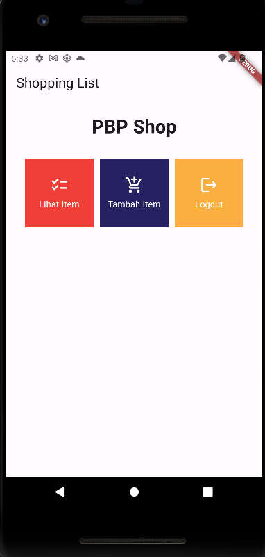

# ACI REZEKI SHOP MOBILE

Nama : Ilham Abdillah Alhamdi

Kelas : PBP-B

NPM : 2206081194

## Daftar Isi

- [Tugas 6](#tugas-6)
  - [Perbedaan _Stateless_ dan _Stateful Widget_ pada Flutter](#perbedaan-stateless-dan-stateful-widget-pada-flutter)
  - [Penjelasan Widget yang Digunakan](#penjelasan-widget-yang-digunakan)
  - [Implementasi Step by Step (Tugas 6)](#implementasi-step-by-step-tugas-6)
  - [Bonus (Tugas 6)](#bonus-tugas-6)


<details open>
<summary><h2 id="tugas-6">Tugas 6</h2></summary>

### Perbedaan _Stateless_ dan _Stateful Widget_ pada Flutter
Widget dalam Flutter dapat bersifat _stateless_ atau _stateful_.

_Stateless widget_ dapat dikatakan sebagai widget **statis** yang berarti widget tersebut **tidak berubah**. Contohnya adalah widget `Text`, `Icon`, atau `IconButton`. Dalam Flutter, semua widget yang bersifat _stateless_ merupakan subclass dari `StatelessWidget`. 

_Stateful widget_ merupakan widget yang **dinamis**. Ini berarti widget ini **dapat mengubah tampilannya** sesuai _response_ dari events yang dipicu baik dari interaksi user maupun adanya variabel atau nilai baru yang didapat. Widget `Checkbox`, `Radio`, `Slider`, `InkWell`, `Form`, dan `TextField` merupakan contoh dari _stateful widget_. Dalam Flutter, semua widget yang bersifat _stateful_ merupakan subclass dari `StatefulWidget`.

Adapun _state_ dari _stateful widget_ disimpan dalam objek `State` yang terpisah dari widget tampilannya. Pada dasarnya, _state_ merupakan suatu variable yang dapat berubah, seperti nilai dari `Checkbox` yang dapat berubah antara `True` atau `False`. Ketika _state_ berubah, maka widget akan merender ulang tampilannya.


### Penjelasan Widget yang Digunakan
Pada tugas ini, saya menggunakan beberapa widget berikut:
- `StatelessWidget` untuk mendefinisikan widget yang bersifat _stateless_.
- `StatefulWidget` untuk mendefinisikan widget yang bersifat _stateful_.
- `MaterialApp` sebagai _base widget_ untuk memungkinkan implementasi Material Widget.
- `AppBar` untuk menampilkan judul aplikasi dan tombol _back_.
- `Scaffold` untuk menampilkan _app bar_ dan _body_.
- `Column` untuk menampilkan _child_ secara vertikal.
- `Row` untuk menampilkan _child_ secara horizontal.
- `Container` untuk menampilkan _child_ dengan memungkinan adanya penambahan _padding_, _margin_, dan beberapa _constraint_ lainnya.
- `Text` untuk menampilkan teks.
- `SingleChildScrollView` untuk menampilkan _child_ sehingga bersifat _scrollable_.
- `Padding` untuk menambahkan _padding_ pada _child_.
- `GridView` untuk menampilkan _child_ dalam bentuk _grid_.
- `Material` untuk menampilkan _child_ dengan _style_ Material Design.
- `InkWell` untuk menampilkan _child_ dengan area yang responsif terhadap sentuhan.
- `Icon` untuk menampilkan _icon_.
- `SnackBar` untuk menampilkan _snackbar_. _Snackbar_ merupakan _widget_ yang muncul di bagian bawah layar untuk menampilkan pesan singkat.


### Implementasi Step by Step (Tugas 6)

1. Membuat project Flutter baru bernama `aci_rezeki_shop_mobile` dengan menjalankan perintah `flutter create aci_rezeki_shop_mobile` pada terminal.

2. Mengubah struktur folder proyek agar sesuai dengan panduan [**Clean Architecture**](https://dev.to/marwamejri/flutter-clean-architecture-1-an-overview-project-structure-4bhf), yaitu dengan menambahkan folder `core`, `data`, `domain`, dan `presentation`. Kemudian menghapus berkas test yang tidak diperlukan.

3. Menghapus _default code_ pada `main.dart` dan menggantinya dengan kode berikut:
    ```dart
    import 'package:flutter/material.dart';
    import 'package:aci_rezeki_shop_mobile/features/main/presentation/view/home.dart';

    void main() {
      runApp(const App());
    }

    class App extends StatelessWidget {
      const App({super.key});

      // This widget is the root of your application.
      @override
      Widget build(BuildContext context) {
        return MaterialApp(
          title: 'Flutter Demo',
          theme: ThemeData(
            colorScheme: ColorScheme.fromSeed(seedColor: Colors.deepPurple),
            useMaterial3: true,
          ),
          home: HomePage(),
        );
      }
    }
    ```
4. Membuat folder `view` pada folder `feature/main/presentation` dan membuat file `home.dart` di dalamnya. File `home.dart` ini akan berisi kode untuk menampilkan halaman utama aplikasi.

5. Membuat _stateless widget_ `HomePage` yang merupakan _child_ dari `StatelessWidget` dan mengimplementasikan _method_ `build` untuk menampilkan _widget_ yang bersifat _stateless_.
    ```dart
    import 'package:flutter/material.dart';
    import 'package:aci_rezeki_shop_mobile/features/main/data/models/menu_item.dart';
    import 'package:aci_rezeki_shop_mobile/features/main/presentation/widget/menu_card.dart';

    class HomePage extends StatelessWidget {
      HomePage({super.key});

      @override
      Widget build(BuildContext context) {
        return Scaffold(
          appBar: AppBar(
            title: const Text(
              'Shopping List',
            ),
          ),
          body: SingleChildScrollView(
            // Widget wrapper yang dapat discroll
            child: Padding(
              padding: const EdgeInsets.all(10.0), // Set padding dari halaman
              child: Column(
                // Widget untuk menampilkan children secara vertikal
                children: <Widget>[
                  const Padding(
                    padding: EdgeInsets.only(top: 10.0, bottom: 10.0),
                    // Widget Text untuk menampilkan tulisan dengan alignment center dan style yang sesuai
                    child: Text(
                      'PBP Shop', // Text yang menandakan toko
                      textAlign: TextAlign.center,
                      style: TextStyle(
                        fontSize: 30,
                        fontWeight: FontWeight.bold,
                      ),
                    ),
                  ),
                  // Grid layout
                  GridView.count(
                    primary: true,
                    padding: const EdgeInsets.all(20),
                    crossAxisSpacing: 10,
                    mainAxisSpacing: 10,
                    crossAxisCount: 3,
                    shrinkWrap: true,
                    children: items.map((MenuItem item) {
                      // Iterasi untuk setiap item
                      return MenuCard(item);
                    }).toList(),
                  ),
                ],
              ),
            ),
          ),
        );
      }
    }

    ```

6. Membuat folder `widget` pada folder `feature/main/presentation` dan membuat file `menu_card.dart` di dalamnya. File `menu_card.dart` ini akan berisi kode widget `MenuCard` yang akan digunakan untuk menampilkan _card_ pada halaman utama aplikasi.
   
7. Menambahkan kode berikut pada file `menu_card.dart` untuk mendefinisikan _stateless widget_ `MenuCard` 
    ```dart
    import 'package:flutter/material.dart';
    import 'package:aci_rezeki_shop_mobile/features/main/data/models/menu_item.dart';

    class MenuCard extends StatelessWidget {
      final MenuItem item;

      const MenuCard(this.item, {super.key}); // Constructor

      @override
      Widget build(BuildContext context) {
        return Material(
          color: Colors.indigo,
          child: InkWell(
            child: Container(
              // Container untuk menyimpan Icon dan Text
              padding: const EdgeInsets.all(8),
              child: Center(
                child: Column(
                  mainAxisAlignment: MainAxisAlignment.center,
                  children: [
                    Icon(
                      item.icon,
                      color: Colors.white,
                      size: 30.0,
                    ),
                    const Padding(padding: EdgeInsets.all(3)),
                    Text(
                      item.name,
                      textAlign: TextAlign.center,
                      style: const TextStyle(color: Colors.white),
                    ),
                  ],
                ),
              ),
            ),
          ),
        );
      }
    }
    ```

8. Membuat folder `models` pada folder `feature/main/data` dan membuat file `menu_item.dart` di dalamnya. File `menu_item.dart` ini akan berisi kode untuk mendefinisikan model `MenuItem` yang akan digunakan untuk menampilkan _card_ pada halaman utama aplikasi.

9. Menambahkan kode berikut pada file `menu_item.dart` untuk mendefinisikan model `MenuItem` 
    ```dart
    import 'package:flutter/material.dart';

    class MenuItem {
      final String name;
      final IconData icon;

      MenuItem(this.name, this.icon);
    }
    ```

10. Menambahkan kode berikut di dalam class `HomePage` pada file `home.dart` untuk mendefinisikan _list_ `items` yang akan digunakan untuk menampilkan _card_ pada halaman utama aplikasi.
    ```dart
    final List<MenuItem> items = [
        MenuItem("Lihat Item", Icons.checklist),
        MenuItem("Tambah Item", Icons.add_shopping_cart),
        MenuItem("Logout", Icons.logout),
      ];
    ```

11. Memunculkan `SnackBar` dengan pesan tertentu ketika `MenuCard` ditekan. Untuk itu, menambahkan kode berikut pada `MenuCard` di bagian `InkWell`:
    ```dart
    // Area responsive terhadap sentuhan
    onTap: () {
      // Memunculkan SnackBar ketika diklik
      ScaffoldMessenger.of(context)
        ..hideCurrentSnackBar()
        ..showSnackBar(SnackBar(
            content: Text("Kamu telah menekan tombol ${item.name}!")));
    }
    ```


### Bonus (Tugas 6)
Mengimplementasikan warna-warna yang berbeda untuk setiap tombol (Lihat Item, Tambah Item, dan Logout)

1. Mengubah model `MenuItem` pada file `menu_item.dart` dengan menambahkan atribut `color` bertipe `Color` dan mengubah constructor `MenuItem` menjadi sebagai berikut:
    ```dart
    import 'package:flutter/material.dart';

    class MenuItem {
      final String name;
      final IconData icon;
      final Color color;

      MenuItem(this.name, this.icon, this.color);
    }
    ```

2. Menambahkan argumen `color` pada `MenuCard` pada file `menu_card.dart` dan mengubah kode `Material` menjadi sebagai berikut:
    ```dart
    ...
    return Material(
      color: item.color,
      child: InkWell(
        ...
      ),
    );
    ...
    ```

3. Menambahkan argumen `color` pada `items` pada file `home.dart` dan mengubah kode `items` menjadi sebagai berikut:
    ```dart
    final List<MenuItem> items = [
        MenuItem("Lihat Item", Icons.checklist, const Color(0xffef3f37)),
        MenuItem("Tambah Item", Icons.add_shopping_cart, const Color(0xff262161)),
        MenuItem("Logout", Icons.logout, const Color(0xfffbaf41)),
      ];
    ```

4. Hasilnya adalah sebagai berikut:<br>
   


</details>